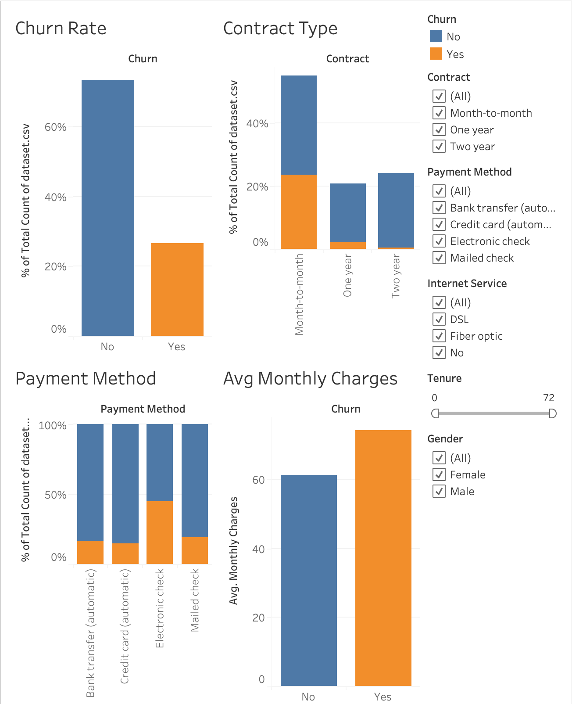

# Customer Churn Analysis – Telecom Dataset

## Overview
This project analyzes 7,043 telecom customer records to identify patterns driving customer churn. Using Python, SQL, and Tableau, the project delivers a structured end-to-end workflow: data cleaning, SQL modeling, database creation, interactive dashboard development, and business insights.

The goal is to understand why customers leave and provide data-driven recommendations to reduce churn and protect recurring revenue.

## Key Insights
(Insights from Executive Summary: Executive Summary.docx)

- Month-to-month contracts show a 43% churn rate, compared to 11% for two-year contracts. Long-term commitments significantly reduce attrition.
- Customers using electronic checks exhibit a 48% churn rate, far higher than auto-pay customers (~16%).
- Churned customers pay about 25% higher monthly charges on average, indicating strong price sensitivity.
- Reducing churn among high-value month-to-month customers by 10% can preserve approximately $1.2 million in annual revenue.

## Business Problem
Telecom companies face high acquisition costs and competitive pressure. Retaining existing customers is more cost-effective than acquiring new ones. This project identifies the financial and behavioral factors behind customer attrition and provides evidence-based strategies to reduce churn.

## Tech Stack
- Python (pandas, numpy)
- SQL / SQLite
- Tableau
- Excel/CSV
- Documentation (Word, Markdown)

## Repository Structure
- churn_sql.py: Python + SQL pipeline for preprocessing
- churn.db: SQLite database with cleaned and modeled data
- dataset.csv: Raw dataset with 7,043 customer records
- Churn Dashboard.twb: Tableau dashboard
- Executive Summary.docx: Business insights and summary
- README.md: Project documentation

## Dashboard Features
- KPI cards for total customers, churn rate, and average revenue per user
- Churn segmented by contract type and payment method
- Monthly charge distribution
- Tenure-based filtering and segmentation
- Internet service type and demographic breakdown
- Fully interactive filters for dynamic exploration

## How to Run the Project

### Step 1: Run SQL/Python preprocessing
python churn_sql.py

### Step 2: Explore the database  
Open `churn.db` using DB Browser for SQLite, VS Code SQL extensions, or Python.

### Step 3: Open the Tableau dashboard
1. Open “Churn Dashboard.twb” in Tableau Desktop.
2. Connect it to `dataset.csv` or `churn.db`.
3. Use filters to explore churn patterns.

## Role and Contributions
- Cleaned and prepared the dataset
- Designed SQL transformations and database structure
- Built the Tableau dashboard
- Conducted churn analysis and developed insights
- Authored the executive summary and documentation

## Future Improvements
- Machine learning churn prediction (Logistic Regression, Random Forest)
- Customer segmentation using clustering
- Automated Python reporting
- Real-time churn scoring through API integration

## Purpose
This project demonstrates the ability to turn raw data into actionable business insights using analytics, visualization, and statistical reasoning. It reflects core skills required in business analytics and data-driven decision-making.
